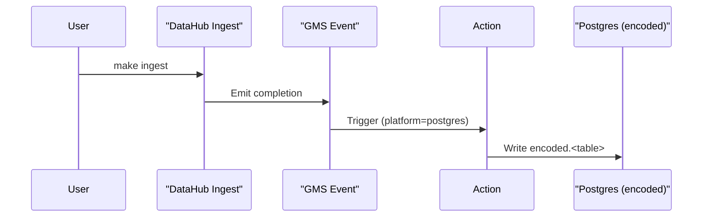

# DataHub + Postgres Base64 Encoding PoC

## Overview
This proof-of-concept runs the DataHub quickstart stack beside a demo Postgres database on an Apple Silicon Mac. When you ingest metadata from Postgres, a lightweight DataHub Action captures the completion event and writes Base64-encoded copies of any TEXT/VARCHAR columns into an `encoded` schema.
It is meant for local experimentation only: no hardening, no production security, and no guarantees about durability beyond the Docker containers it spins up.

## Prerequisites
- macOS 13+ on Apple Silicon (M1/M2) with Docker Desktop running
- Python 3.11 available if you want to run the smoke test
- `make`, `docker compose`, and enough disk for container images (multi-arch/arm64 ready)

## Quick Start
- `make up` — bring up the stack, seed Postgres, start the Base64 action watcher
- `make ingest` — rerun the DataHub Postgres ingestion on demand
- `make logs` — tail DataHub GMS + Base64 action logs together
- `make psql` — open a `psql` shell against the demo Postgres database
- `make down` — stop and remove containers, networks, and volumes

## Run from Frontend
1. Browse to `http://localhost:9002` and sign in (default credentials: `datahub` / `datahub`).
   _Screenshot placeholder: DataHub home page_
2. Open **Ingestion → Sources**, click **+ New Source**, and pick the **Postgres** tile.
   _Screenshot placeholder: Postgres source wizard_
   - Give the source a friendly name such as `Postgres Demo`.
   - Set the **Pipeline Name** to `postgres_local_poc` so it matches the CLI recipe and Base64 action filter.
   - Expand **Advanced recipe** and paste the same YAML used by `make ingest`:

     ```yaml
     pipeline_name: postgres_local_poc
     source:
       type: postgres
       config:
         host_port: postgres:5432
         database: postgres
         username: datahub
         password: datahub
         schema_pattern:
           allow:
             - public.*
         profiling:
           enabled: false
     sink:
       type: datahub-rest
       config:
         server: http://datahub-gms:8080
     ```
     _(Keeping `pipeline_name` in the YAML is optional but keeps the CLI and UI recipes identical.)_

3. Click **Next → Test Connection** (should succeed) and **Next → Schedule & Run**. Leave the schedule as **On Demand** and hit **Run**.
   _Screenshot placeholder: Schedule & Run step_
4. Watch the run under **Ingestion → Runs**. It will briefly show **Pending** until the local `ui-ingestion-runner` helper container replays the recipe, then flip to **Running → Succeeded** with inline logs.
   - Tail progress via `docker compose logs -f ui-ingestion-runner` if you want to see the CLI output.
   _Screenshot placeholder: Ingestion run list_
5. The Base64 action container notices the new metadata and performs tokenization automatically. Tail logs with `make logs` and look for entries like:

   ```text
   base64-action   | INFO  Processing 3 dataset(s) for run id scan-1700001234
   base64-action   | INFO  Encoding urn:li:dataset:(urn:li:dataPlatform:postgres,postgres.public.customers,PROD) => public.customers (text columns: first_name, email)
   base64-action   | INFO  Finished encoding urn:li:dataset:(...,orders,PROD) (120 rows)
   ```

6. **Option B helper**: if you ever want to trigger the action once on demand (for example, immediately after a UI run finishes), execute `./scripts/tokenize-once.sh`. It calls `python action.py --once` inside the running container.
7. Acceptance checks:
   - `make psql` → `\dn+` should show an `encoded` schema.
   - `SELECT COUNT(*) FROM encoded.customers;` matches the `public.customers` row count.
   - Action logs contain `Processing ... dataset(s)` aligned with the ingestion run timestamp.
   - The Ingestion Runs page displays the job as **Succeeded** with the same run ID as the UI trigger.

## Step-by-Step: What Happens

### Step 1 — Start services (`make up`)
Brings up DataHub (GMS, Frontend, Kafka, MySQL, OpenSearch), Postgres with sample tables, and the Base64 action container. The make target waits for GMS health before seeding metadata.

```bash
make up
```

Expected log highlights:
```text
datahub-gms     | INFO  main DataHub GMS started on port 8080
postgres        | LOG   database system is ready to accept connections
base64-action   | INFO  Action ready. Watching DataHub runs for platform='postgres' pipeline='postgres_local_poc'.
ui-ingestion-runner | [ui-runner] Starting poller against http://datahub-gms:8080 (interval=15s)
```

### Step 2 — Ingest metadata (`make ingest`)
Runs the recipe at `ingest/postgres_recipe.yml`, which points at `postgres:5432` with user `datahub/datahub` and filters `public.*`. The command executes inside the dedicated `ingestion` container.

```bash
make ingest
```

Expected log highlights:
```text
ingestion-run   | INFO  Starting postgres ingest (ingest/postgres_recipe.yml)
ingestion-run   | INFO  Discovered tables: public.customers, public.orders, public.payments
ingestion-run   | INFO  Emitted 3 MetadataChangeEvents to http://datahub-gms:8080
ingestion-run   | INFO  Postgres ingestion completed successfully
```

### Step 3 — Tokenization action runs automatically
The action watches for ingestion completion events where `platform=postgres` and (by default) `pipeline_name=postgres_local_poc`. When those appear, it enumerates the datasets, Base64-encodes textual columns, and upserts into `encoded.<table>`.

```bash
make logs
```

Expected log highlights:
```text
base64-action   | INFO  Processing 3 dataset(s) for run id scan-1700000000
base64-action   | INFO  Encoding urn:li:dataset:(urn:li:dataPlatform:postgres,postgres.public.customers,PROD) => public.customers (text columns: first_name, email)
base64-action   | INFO  Finished encoding urn:li:dataset:(...,PROD) (120 rows)
base64-action   | INFO  No data change detected for urn:li:dataset:(...,orders,PROD); skipping
```

### Step 4 — Verify results (`make psql`)
Connect to Postgres and inspect the encoded tables. You should see Base64 strings in place of plain text.

```bash
make psql
```

Inside `psql`:
```sql
SELECT first_name, email FROM encoded.customers LIMIT 3;
```

Sample output:
```text
 first_name |          email
------------+---------------------------
 TWFyeQ==   | bWFyeUBleGFtcGxlLmNvbQ==
 Sm9u       | am9uQGV4YW1wbGUuY29t
 IFNlbmE=   | c2VuYUBleGFtcGxlLm5ldA==
```

## How the Trigger Works
- Ingestion finishes -> DataHub GMS emits a metadata change completion event.
- The Base64 action filters events for `platform=postgres` (and optional `pipeline_name`).
- Matching events cause the action to connect to Postgres, create the `encoded` schema if needed, and copy tables while Base64-encoding TEXT/VARCHAR columns.
- Runs are idempotent thanks to the `encoded._action_audit` table: unchanged tables are skipped on subsequent scans.



## Configuration You Might Change
- `ingest/postgres_recipe.yml` — adjust `host_port`, credentials, schema filters, or pipeline name.
- `actions/base64_action/config.yml` — override `gms_url`, `platform`, `pipeline_name`, and the Postgres connection block; env vars with the same names take precedence.
- `Makefile` (`PIPELINE_NAME`) — keep this in sync with the ingestion recipe if you change it so the action filter still matches.

## Troubleshooting
- **Hostname mismatch**: If logs show `could not translate host`, ensure the recipe uses Docker service names (e.g. `postgres`) while local tools use `localhost`.
- **Connection refused**: Confirm ports 8080 and 5432 are free and the containers are running with `docker ps`.
- **No encoded tables**: Check `make logs` for action errors and re-run `make ingest` to emit fresh events.
- **Apple Silicon images**: All images are multi-arch; if pulls fail, update Docker Desktop and retry.

## Clean Up
```bash
make down
```
Removes all running containers, networks, and volumes created for this PoC.
