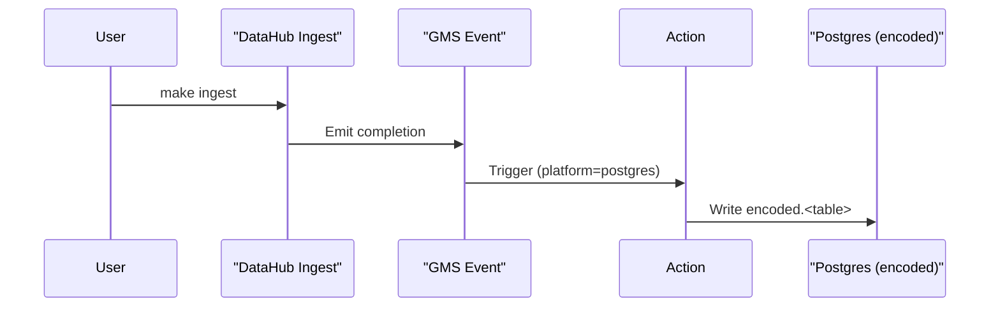

# DataHub + Postgres Base64 Encoding PoC

## Overview
This proof-of-concept runs the DataHub quickstart stack beside a demo Postgres database on an Apple Silicon Mac. When you ingest metadata from Postgres, a lightweight DataHub Action captures the completion event and writes Base64-encoded copies of any TEXT/VARCHAR columns into an `encoded` schema.
It is meant for local experimentation only: no hardening, no production security, and no guarantees about durability beyond the Docker containers it spins up.

## Prerequisites
- macOS 13+ on Apple Silicon (M1/M2) with Docker Desktop running
- Python 3.11 available if you want to run the smoke test
- `make`, `docker compose`, and enough disk for container images (multi-arch/arm64 ready)

## Quick Start
- `make up` — bring up the stack, seed Postgres, start the Base64 action watcher
- `make ingest` — rerun the DataHub Postgres ingestion on demand
- `make logs` — tail DataHub GMS + Base64 action logs together
- `make psql` — open a `psql` shell against the demo Postgres database
- `make down` — stop and remove containers, networks, and volumes

## Run from UI
1. Launch `http://localhost:9002`, sign in (`datahub` / `datahub`), and add a **Postgres** source. Paste the provided recipe from the task description or reuse `ingest/postgres_recipe.yml`.

   ```yaml
   pipeline_name: urn:li:dataHubIngestionSource:0ce41f93-2590-40e5-8f25-fbc7b2433170
   source:
     type: postgres
     config:
       host_port: host.docker.internal:5432
       database: lseat
       username: postgres
       password: postgres
       schema_pattern:
         allow:
           - public.*
       profiling:
         enabled: true
         profile_table_level_only: true
   ```

   _Expected helper logs while the recipe is normalized for containers:_

   ```text
   ui-ingestion-runner | INFO [ui-runner] Prepared recipe for urn:li:dataHubExecutionRequest:... (pipeline=urn:li:dataHubIngestionSource:0ce41f93-...)
   ui-ingestion-runner | INFO [ui-runner] Starting ingestion for urn:li:dataHubExecutionRequest:... using executor ui-ingestion-runner (pipeline=...)
   ui-ingestion-runner | INFO [ui-runner] Ingestion and tokenization for urn:li:dataHubExecutionRequest:... completed successfully
   ```

2. Open **Ingestion → Runs**. The run should advance from **PENDING → RUNNING → SUCCEEDED** with logs.

   ```text
   ui-ingestion-runner | INFO [ui-runner] Detected pending execution urn:li:dataHubExecutionRequest:...
   datahub-frontend   | ... Run status transitioned to RUNNING (logs streaming)
   ui-ingestion-runner | INFO [ui-runner] Execution urn:li:dataHubExecutionRequest:... finished with status SUCCEEDED
   ```

3. Confirm automatic tokenization with `docker compose logs -f base64-action`.

   ```text
   base64-action      | INFO base64-action Action ready. Watching DataHub runs for platform='postgres' pipeline='urn:li:dataHubIngestionSource:0ce41f93-...'
   base64-action      | INFO base64-action Processing 3 dataset(s) for run id scan-1700001234
   base64-action      | INFO base64-action Encoding urn:li:dataset:(urn:li:dataPlatform:postgres,lseat.public.customers,PROD) => public.customers (text columns: first_name, email)
   base64-action      | INFO base64-action Finished encoding urn:li:dataset:(...,orders,PROD) (120 rows)
   ```

4. Re-run the same source from the UI. Tokenization should skip unchanged tables instead of duplicating them.

   ```text
   ui-ingestion-runner | INFO [ui-runner] Detected pending execution urn:li:dataHubExecutionRequest:...
   base64-action      | INFO base64-action No data change detected for urn:li:dataset:(...,customers,PROD); skipping
   base64-action      | INFO base64-action No data change detected for urn:li:dataset:(...,orders,PROD); skipping
   ```

5. Verify the encoded schema from `psql`.

   ```sql
   \dn+ encoded
   SELECT COUNT(*) FROM encoded.customers;
   ```

   ```text
   encoded | datahub | ...
   count
   -------
       120
   ```

Acceptance checks:
- UI run shows **RUNNING → COMPLETED** with non-empty logs (no “No Output”).
- `encoded` schema exists; table counts mirror source; TEXT/VARCHAR columns are Base64 values.
- Re-running from UI does not duplicate rows (`base64-action` logs “No data change detected”).
- `make ingest` continues to succeed for the CLI path.

## Step-by-Step: What Happens

### Step 1 — Start services (`make up`)
Brings up DataHub (GMS, Frontend, Kafka, MySQL, OpenSearch), Postgres with sample tables, and the Base64 action container. The make target waits for GMS health before seeding metadata.

```bash
make up
```

Expected log highlights:
```text
datahub-gms        | INFO  main DataHub GMS started on port 8080
postgres           | LOG   database system is ready to accept connections
base64-action      | INFO  Action ready. Watching DataHub runs for platform='postgres' pipeline='postgres_local_poc'.
ui-ingestion-runner | INFO [ui-runner] Starting poller against http://datahub-gms:8080 (interval=15s, executor=ui-ingestion-runner)
```

### Step 2 — Ingest metadata (`make ingest`)
Runs the recipe at `ingest/postgres_recipe.yml`, which points at `postgres:5432` with user `datahub/datahub` and filters `public.*`. The command executes inside the dedicated `ingestion` container.

```bash
make ingest
```

Expected log highlights:
```text
ingestion-run   | INFO  Starting postgres ingest (ingest/postgres_recipe.yml)
ingestion-run   | INFO  Discovered tables: public.customers, public.orders, public.payments
ingestion-run   | INFO  Emitted 3 MetadataChangeEvents to http://datahub-gms:8080
ingestion-run   | INFO  Postgres ingestion completed successfully
```

### Step 3 — Tokenization action runs automatically
The action watches for ingestion completion events where `platform=postgres` and (by default) `pipeline_name=postgres_local_poc`. When those appear, it enumerates the datasets, Base64-encodes textual columns, and upserts into `encoded.<table>`.

```bash
make logs
```

Expected log highlights:
```text
base64-action   | INFO  Processing 3 dataset(s) for run id scan-1700000000
base64-action   | INFO  Encoding urn:li:dataset:(urn:li:dataPlatform:postgres,postgres.public.customers,PROD) => public.customers (text columns: first_name, email)
base64-action   | INFO  Finished encoding urn:li:dataset:(...,PROD) (120 rows)
base64-action   | INFO  No data change detected for urn:li:dataset:(...,orders,PROD); skipping
```

### Step 4 — Verify results (`make psql`)
Connect to Postgres and inspect the encoded tables. You should see Base64 strings in place of plain text.

```bash
make psql
```

Inside `psql`:
```sql
SELECT first_name, email FROM encoded.customers LIMIT 3;
```

Sample output:
```text
 first_name |          email
------------+---------------------------
 TWFyeQ==   | bWFyeUBleGFtcGxlLmNvbQ==
 Sm9u       | am9uQGV4YW1wbGUuY29t
 IFNlbmE=   | c2VuYUBleGFtcGxlLm5ldA==
```

## How the Trigger Works
- Ingestion finishes -> DataHub GMS emits a metadata change completion event.
- The Base64 action filters events for `platform=postgres` (and optional `pipeline_name`).
- Matching events cause the action to connect to Postgres, create the `encoded` schema if needed, and copy tables while Base64-encoding TEXT/VARCHAR columns.
- Runs are idempotent thanks to the `encoded._action_audit` table: unchanged tables are skipped on subsequent scans.



## Troubleshooting Guide
- **UI run stuck in PENDING / No Output**: verify UI ingestion is enabled (`UI_INGESTION_ENABLED=true` in `docker-compose.yml`) and the helper container can reach GMS. Run `docker compose logs -f ui-ingestion-runner` to confirm it prints “Starting poller …”.
- **Database connection failures**: the runner rewrites `localhost`/`host.docker.internal` to the Docker service name automatically. If the source lives elsewhere, adjust `host_port` and confirm reachability with `docker compose exec ingestion nc -vz <host> <port>`.
- **Tokenization not firing**: check `base64-action` logs for “Action ready …” followed by dataset summaries. Missing logs often mean the pipeline name or database name does not match the ingestion recipe; ensure the UI recipe’s values align with the Base64 overrides.
- **Permission or auth errors**: the helper and action use the same credentials as the UI recipe. Update both the recipe and the `.env`/`docker-compose.yml` overrides if passwords change.
- **Endpoint sanity checks**: `curl http://localhost:8080/health` validates GMS; `curl -XPOST http://localhost:8080/api/graphql -d '{"query":"{ health { status } }"}'` ensures GraphQL responds. Use `docker compose logs -f datahub-gms datahub-frontend` for deeper errors.

## Configuration You Might Change
- `ingest/postgres_recipe.yml` — adjust `host_port`, credentials, schema filters, or pipeline name.
- `actions/base64_action/config.yml` — override `gms_url`, `platform`, `pipeline_name`, and the Postgres connection block; env vars with the same names take precedence.
- `Makefile` (`PIPELINE_NAME`) — keep this in sync with the ingestion recipe if you change it so the action filter still matches.

## Troubleshooting
- **Hostname mismatch**: If logs show `could not translate host`, ensure the recipe uses Docker service names (e.g. `postgres`) while local tools use `localhost`.
- **Connection refused**: Confirm ports 8080 and 5432 are free and the containers are running with `docker ps`.
- **No encoded tables**: Check `make logs` for action errors and re-run `make ingest` to emit fresh events.
- **Apple Silicon images**: All images are multi-arch; if pulls fail, update Docker Desktop and retry.

## Clean Up
```bash
make down
```
Removes all running containers, networks, and volumes created for this PoC.
